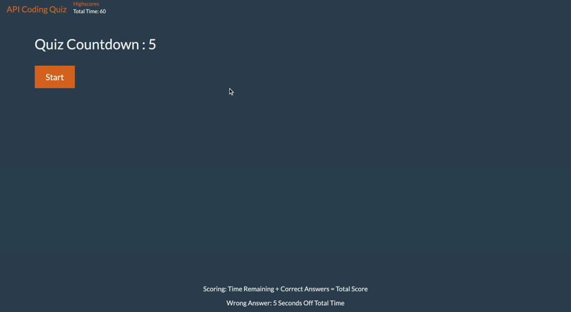

# Api-Quiz

## Description
This project was the first assingment that I started to use all of the elements that I have learned thus far. I learned that it takes a lot of trial and error to make something like this work. Even though I eventually got everything to work I had to spend a lot of my time trying to figure out how to make one thing work. Once I found the piece of the puzzle I was missing everything started to click into place. I even learned things that I did not know before like how to implement *JQuery*. Now knowing some things about *JQuery* I realize that things can be much easier and more simple to read using this.

I first started with creating a basic layout of my pages and then went into creating all of the questions and answers. Knowing now from doing this it may have been easier if I split my question array of objects into smaller pieces inside of the object. But, I stuck with what I started out with and finally figured out how to list them in their appropriate spots. Then I continued on piece by piece checking my <console.log> every step of the way. I came across some blocks where I did eventually troubleshoot even though at times it was defeating. I am noticing a pattern that is very encouraging though, eventually it will come together. Even if its not the best creation I've ever had, if I don't get it looking the exact way I want it I can always come back and put more into this with the more knowledge I obtain.

## Usage
**Below is how to use the application**

**A link to deployed application below**
* *https://lambaa94.github.io/Api-Quiz/*

## Credits

* *https://bootswatch.com* 
* *https://www.favicon.cc/*
* *https://fontawesome.com/*
- Various creators
* *University of Pennsylvania's Class Videos
- Instruction led by Dave Leonhardt